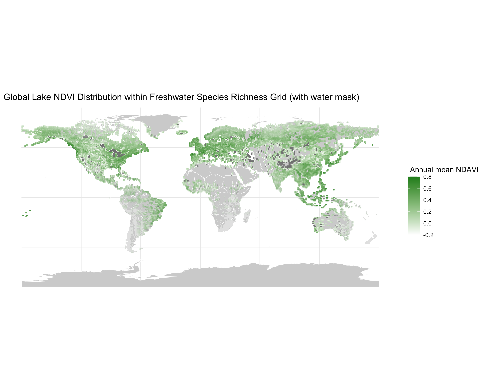

# Global Freshwater Productivity from MODIS Imagery

This repository presents a geospatial workflow for estimating freshwater vegetation productivity in global river and lake systems using satellite-derived vegetation indices. The project computes annual **NDVI** and **NDAVI** from **MODIS MCD43A4** reflectance data, integrates these indices with global hydrographic and freshwater plant species richness layers in **Google Earth Engine**, and produces spatially explicit productivity metrics at **500 m resolution**.

A central methodological contribution of this workflow is the use of **water masking** to address the **mixed-pixel problem** in moderate-resolution satellite imagery. By restricting water-specific summaries to pixels that are predominantly water, the workflow improves the ecological interpretability of vegetation signals in aquatic environments.

## Live HTML report
[Open the workflow report here](<https://rebekah24.github.io/global-freshwater-productivity-modis/>)

## Project overview

Freshwater vegetation is an important indicator of ecosystem condition and biodiversity. This workflow was developed to generate annual productivity metrics for rivers and lakes at global scale, with outputs designed for downstream ecological analysis of the productivity–species richness relationship in freshwater systems.

The workflow produces:

- annual **NDVI** composites
- annual **NDAVI** composites
- water-masked vegetation summaries
- cell-level productivity metrics for rivers and lakes
- global maps and validation outputs for interpretation

## Why this project matters

At 500 m resolution, many pixels in freshwater environments contain a mixture of water, shoreline vegetation, surrounding forest, agriculture, or urban land cover. Without accounting for this, vegetation indices can reflect both aquatic and terrestrial signals, making interpretation difficult.

This workflow addresses that issue by incorporating a **MODIS water mask**, resampling it to match the analytical resolution, and applying a conservative threshold to isolate aquatic-dominant pixels. This helps ensure that water-specific vegetation metrics better represent freshwater systems rather than adjacent land cover.

## Data sources

This project integrates multiple spatial datasets, including:

- **MODIS MCD43A4** Nadir BRDF-Adjusted Reflectance (NBAR)
- **MOD44W** water mask
- global river spatial data
- global lake polygon data
- global freshwater plant species richness grid

## Methods summary

The workflow:

1. Retrieves annual MODIS reflectance imagery for the target year
2. Calculates annual mean **NDVI** and **NDAVI**
3. Reprojects outputs to match the species richness grid
4. Resamples the MODIS water mask from 250 m to 500 m
5. Applies a conservative water-dominance threshold to reduce mixed-pixel contamination
6. Summarizes vegetation metrics within river and lake areas for each grid cell
7. Produces exportable outputs for mapping, validation, and downstream ecological modelling

## Key methodological contribution

A major feature of this project is the treatment of the **mixed-pixel problem** in aquatic remote sensing.

Rather than relying only on unmasked vegetation indices, the workflow converts the water mask into a water-fraction layer and restricts water-specific summaries to pixels with sufficient water coverage. This improves the ecological validity of productivity estimates in freshwater environments and makes the outputs more suitable for biodiversity analyses.

## Repository contents

- `Annual_freshwater_vegetation_index_workflow.Rmd`  
  Full workflow documentation, methods, code, and example outputs

- `docs/`  
  Rendered report files such as HTML or PDF versions of the workflow

- `figures/lake_ndvi_map.png`  
  Selected output maps and visualizations

- `README.md`  
  Project summary and guide to repository contents

## Visual outputs

This workflow generates global maps of:

- lake NDVI
- lake NDAVI
- river NDVI
- river NDAVI

These outputs are summarized spatially within freshwater plant species richness grid cells and can be used for ecological interpretation and further modelling.

## Tools and packages

This project was developed in **R** using geospatial and data analysis tools, including:

- `rgee`
- `sf`
- `stars`
- `dplyr`
- `tidyr`
- `ggplot2`
- `stringr`
- `rnaturalearth`
- `pointblank`

## How to use this repository

This repository is intended as a project portfolio piece and workflow record.

To explore the project:

1. Read this `README.md` for the project summary
2. Open the `.Rmd` file to view the full workflow and code
3. View the rendered report in `docs/`
4. Browse selected figures in `figures/`

## Notes

Some original datasets or intermediate objects may not be included in this repository due to file size or storage limitations. The R Markdown file documents the workflow, and rendered reports and figures are included to show the analytical logic, structure, and outputs of the project.

## Future improvements

Potential next steps for this workflow include:

- extending the analysis across multiple years
- comparing masked and unmasked productivity metrics quantitatively
- integrating additional environmental covariates
- linking productivity patterns more directly to species richness modelling

